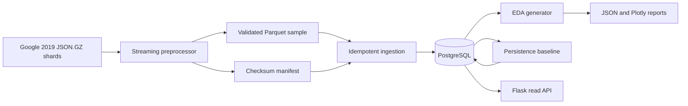
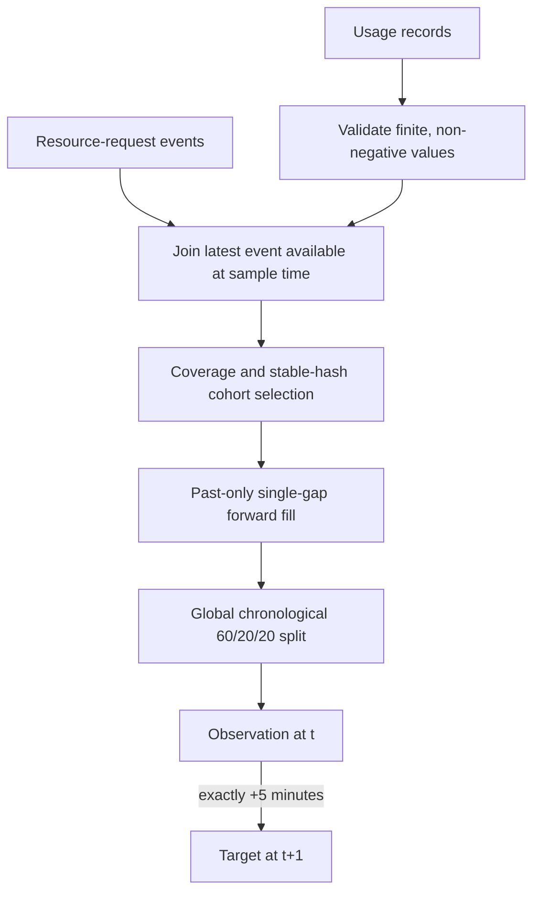
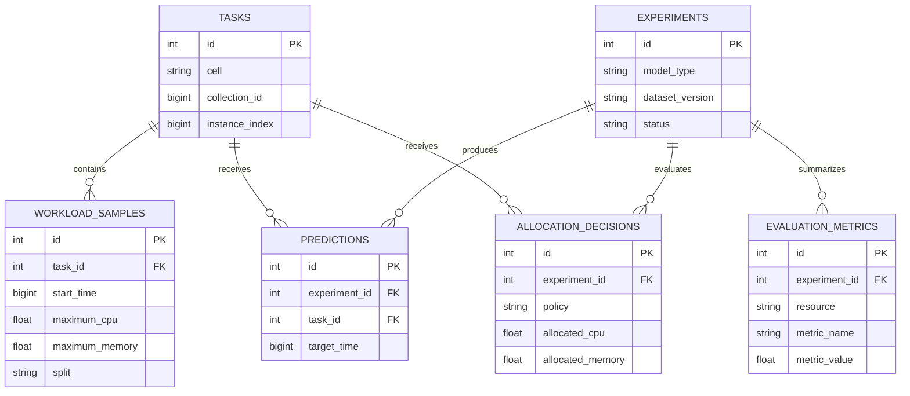
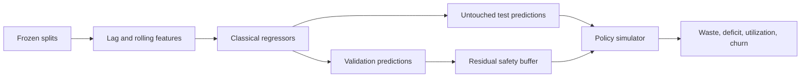

# Architecture and experiment flows

## System architecture

Green-path scope at 30% is represented by every component above. Advanced models, allocation simulation, recommendation endpoints, and the analytics dashboard are later components and are not silently mocked.

## Data flow and leakage boundary

An event is joined only when its event time is no later than the workload sample. Persistence prediction uses the current maximum only, and forecast pairs cannot cross a long gap.

## Entity relationship diagram

The allocation tables are scaffolded now so later migrations do not disrupt stored baseline experiments; they remain empty at 30%.

## Full experiment flow planned after 30%

